## Start Postgres

```bash
docker-compose up -d
```

Read more about integrating this database with a Dockerized MCP server on my website [here](https://miketoscano.com/blog/?post=docker-mcp-toolkit-postgres)

Learn how to utilize Docker's MCP Catalog to create custom agentic applications with LangChain and LangGraph [here](https://miketoscano.com/blog/?post=docker-mcp-langgraph-agent)

```mermaid
%%{init: {
  "theme": "dark"
} }%%
graph TB
    %% Core Components
    subgraph UserLayer["👥 User Interface Layer"]
        ChatInterface[💬 Chat Application<br/>Python/Streamlit/FastAPI]
    end
    
    subgraph AgentLayer["🤖 AI Agent Layer"]
        LangChainAgent[⚡ LangChain ReAct Agent<br/>- Query Planning<br/>- Multi-step Reasoning<br/>- Tool Orchestration]
        AgentMemory[💾 Conversation State<br/>MemorySaver]
    end
    
    subgraph MCPLayer["🔗 MCP Integration Layer"]
        MCPClient[📡 MCP Client<br/>langchain-mcp-adapters]
        MCPServer[🐳 MCP Server<br/>Docker Container<br/>mcp/postgres:latest]
    end
    
    subgraph DataLayer["📊 Data Layer"]
        Database[(🗄️ PostgreSQL Database<br/>Your Business Data)]
    end
    
    subgraph Infrastructure["🏗️ Infrastructure"]
        Docker[🐳 Docker Compose<br/>- Container Orchestration<br/>- Network Isolation<br/>- Service Discovery]
        LLMRuntime[🧠 LLM Runtime<br/>Ollama/OpenAI API]
    end
    
    %% Connections
    ChatInterface --> LangChainAgent
    LangChainAgent --> AgentMemory
    LangChainAgent --> MCPClient
    MCPClient -->|stdio protocol| MCPServer
    MCPServer -->|SQL queries| Database
    LangChainAgent --> LLMRuntime
    
    %% Infrastructure connections
    ChatInterface -.->|deployed in| Docker
    MCPServer -.->|managed by| Docker
    Database -.->|managed by| Docker
    
    %% Data Flow
    Database -->|results| MCPServer
    MCPServer -->|JSON response| MCPClient
    MCPClient -->|tool results| LangChainAgent
    LangChainAgent -->|formatted output| ChatInterface
```

